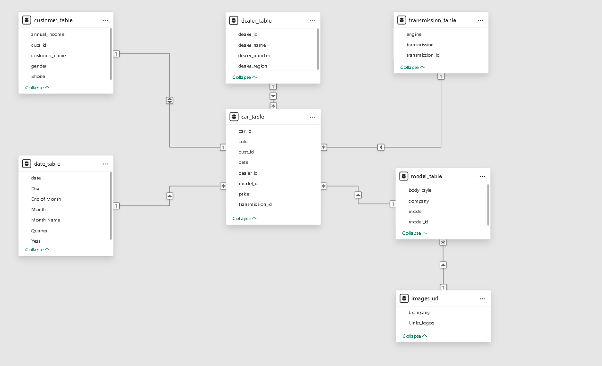
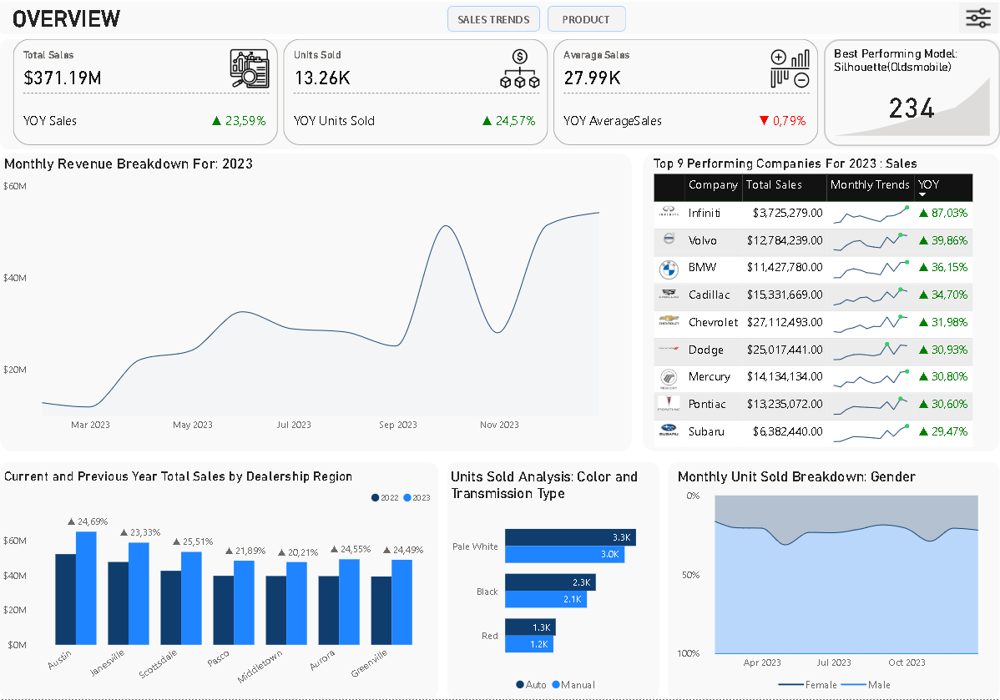
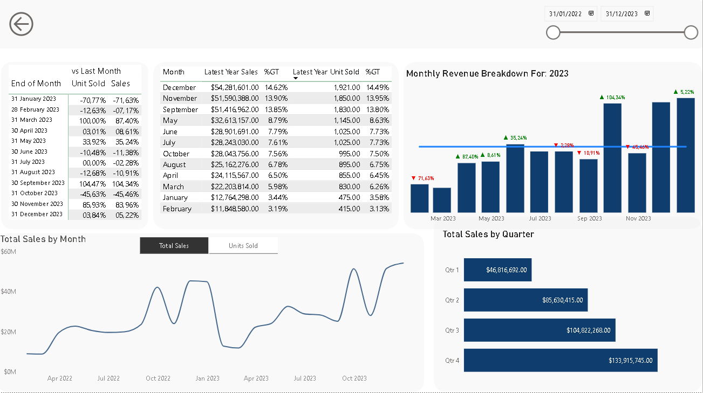
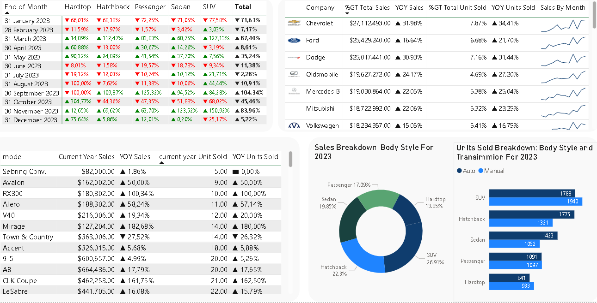

# Automotive Sales Analysis – 2023 vs. 2022

## Project Overview

The goal of this analysis is to **identify and analyze the key factors** that contributed to a **24% increase in sales in 2023** compared to 2022, using historical automotive sales data.

### Focus Areas:
- **Sales Trends** – Examine seasonality, growth spikes, and monthly patterns over 24 months.
- **Product Performance** – Identify top-performing products, new launches, and shifts in product mix or pricing.

---

## Important Files

| Task | Link |
|------|------|
| Original Datasets | *(Add link here)* |
| Data Cleaning in SQL | *(Add link here)* |
| Data Inspection in SQL | *(Add link here)* |
| Data Validation in SQL | *(Add link here)* |
| Normalization in SQL | *(Add link here)* |
| Power BI Dashboard | *(Add link here)* |

---

## Data Structure Overview

#### `car_table`
- Columns: `car_id`, `sale_date`, `color`, `price`, `cust_id`, `model_id`, `transmission_id`, `dealer_id`
- Description: Transaction-level data for each car sold, including sale details and foreign keys linking to other tables.

#### `customer_table`
- Columns: `cust_id`, `customer_name`, `gender`, `annual_income`, `phone`
- Description: Customer demographic and contact information.

#### `dealer_table`
- Columns: `dealer_id`, `dealer_name`, `dealer_number`, `dealer_region`
- Description: Information about each dealership including location and contact.

#### `model_table`
- Columns: `model_id`, `company`, `model`, `body_style`
- Description: Car model details including brand and body style.

#### `transmission_table`
- Columns: `trans_id`, `transmission`, `engine`
- Description: Transmission type and engine specifications.

#### `Entity Relationship Diagram`

---

## Executive Summary

- In 2023, total sales reached $371.19 million, reflecting a 23.59% increase over 2022. Unit sales totaled 13,261, up 24.57% year-over-year. The Oldsmobile Silhouette was the best-selling model with 234 units sold.

- Sales increased from January ($12.76M) to June ($32.61M), dipped from July through August, and then surged 104.34% in September. A significant drop occurred in October (-45.46% MoM), before recovering with a pre-holiday-driven surge in November (+83.96% MoM).

- By manufacturer, Chevrolet led in total revenue ($27.11M), while Infiniti saw the highest sales growth (+87.03% YoY). Austin topped regional sales with $65.04M, whereas Scottsdale had the strongest YoY growth (+25.51%).

- Customer preferences leaned toward Pale White vehicles (48% of units sold) and automatic transmissions (52.17% vs. 47.83% manual). 
- Male buyers accounted for 77.57% of all units sold.

- These sales trends highlight critical seasonal opportunities and regional strengths, guiding targeted marketing efforts and inventory planning to sustain growth in 2024.

---

## Insights Deep Dive

### 1️. Sales Trends Insights

- December 2023 contributed the highest share of total sales, accounting for 14.62% of the annual revenue ($371.17M), followed by November with 13.90%. In contrast, February was the lowest-performing month, contributing only 3.19%.

- In January, unit sales experienced a significant month-over-month (MoM) decline of -70.77% compared to December 2022. This drop is likely due to strong seasonal sales in December and typically low buyer activity in January.

- February saw a further MoM decline of -12.63% in unit sales compared to January. Historically, January and February have been the weakest months in both 2022 and 2023, reflecting a consistent seasonal dip following December's peak sales.

- From March to June, unit sales steadily increased, before experiencing a minor decline from June to September.

- The steepest increase in unit sales occurred in September, with a +104.47% MoM surge following a -12.68% MoM dip in August. This spike is likely due to seasonal promotions.

- In October, sales dropped sharply by -45.63% MoM (Units Sold) compared to September. This decline may reflect a pause in customer purchases as they awaited Black Friday or holiday season deals, which explains the strong rebound in November (+85.93% MoM) and a continued surge in December (+3.84% MoM).

- The months of May, September, November, and December performed above the 2023 average monthly sales, indicating strong seasonal performance. The remaining months were below average, with February being the weakest, totaling only $11.85 million in sales.

- Q4 2023 recorded the highest quarterly sales at $133.92 million, which was a 186.04% increase over Q1, the lowest-performing quarter at $46.82 million. Q4 accounted for 36.08% of the total annual sales, emphasizing the importance of year-end performance.

- Both 2022 and 2023 followed similar sales trends, with peaks in September, followed by significant declines in October, and then strong surges in November and December, suggesting a recurring seasonal pattern in customer behavior.
  
  
---

### 2️. Product Performance & Body Style Insights (2023)

  - In September 2023, the sharp +104.34% month-over-month (MoM) increase in overall sales was primarily driven by a +125.32% MoM surge in Passenger Vehicles, followed by Hatchback Vehicles (+109.87% MoM). However, a -100% MoM decline in Hardtop Vehicle sales dampened the overall gain.
  
  - The October sales decline (-45.46% MoM) was largely due to a significant drop in SUV sales (-68.02% MoM), although Hardtop Vehicles rebounded impressively with a (+304.77% MoM) increase.
  
  - March (+87.40% MoM), May (+35.24% MoM) and November (+83.96% MoM) were the only months in 2023 where all body styles (Hardtop, Hatchback, Passenger, Sedan, and SUV) recorded positive MoM growth. Conversely, January (-71.63% MoM) and June (-11.38% MoM) saw declines across all body styles.
  
  - In terms of unit sales, the Silhouette was the top performer with 234 units sold (+32.20% YoY). However, the Lexus LS400 generated the highest revenue, totaling $7.92 million (+26.36% YoY).
  
  - The worst-performing model was the Sebring Convertible, with only 5 units sold and $82,000 in total revenue, suggesting a positive correlation between units sold and total revenue.
  
  - SUVs contributed the most, accounting for 26.91% of total sales. Hatchbacks followed with 22.30%, while Hardtops contributed the least at 13.85%.
  
  - Units sold were higher for automatic transmissions (6,918) compared to manual transmissions (6,343). The largest divergence by transmission type was seen in the Hatchback segment, where automatic vehicles outsold manual by 454 units.
 

#### Revenue by Body Style (Top Brands):

| Body Style | Top Brand | Revenue | YoY Growth |
|------------|------------|---------|------------|
| SUV        | Dodge      | $10.27M | +55.19%    |
| Sedan      | Oldsmobile | $10.53M | +20.36%    |
| Passenger  | Volkswagen | $6.27M  | +4.23%     |
| Hatchback  | Ford       | $6.86M  | +5.58%     |
| Hardtop    | Chevrolet  | $6.67M  | +48.52%    |

---

## Recommendations & Strategic Actions

- **Phase Out Sebring Convertible**:Sales remain critically low with only a +1.86% year-over-year (YoY) increase, showing no significant improvement compared to 2022. It is advisable to consider phasing out this model due to consistently poor performance in both units sold and revenue.
- **Optimize Hardtop Sales During Peak Months:**:Although Hardtop sales saw occasional spikes ( +304.77% MoM in October), overall contribution remains low at 13.85% of total sales. Re-strategize pricing, promotions, and inventory for Hardtop models, particularly during high-traffic months like September, to maximize returns.
- **Expand High-Performing Brands**: Consider expanding the model range for brands with strong sales performance, including Chevrolet, Volvo, BMW, and other top 9 revenue-generating companies. Introducing new or refreshed models under these brands can capitalize on existing brand momentum.
- **Boost Marketing in Weak Months**: Months like January and October, which historically underperform, require targeted marketing campaigns, limited-time offers, and customer incentives to stimulate demand during these slow periods.
- **Use Dynamic Pricing in Peak Months**: During peak sales months such as May, September, November, and December, consider dynamic pricing strategies, bundling, or value-added promotions to further boost revenue and capitalize on seasonal demand.

- **Improve Dealer Region Strategy**:Focus on for better returns.Re-evaluate pricing strategies and strengthen marketing efforts in underperforming dealer regions such as **Pasco** (+21.89% YoY) and **Middletown** (+20.21% YoY).
---

## Reference

- Images in Power BI dashboard sourced from [carlogos.org](https://www.carlogos.org/)

---

## Acronyms Used

- **MoM** – Month-over-Month  
- **YoY** – Year-over-Year

---

